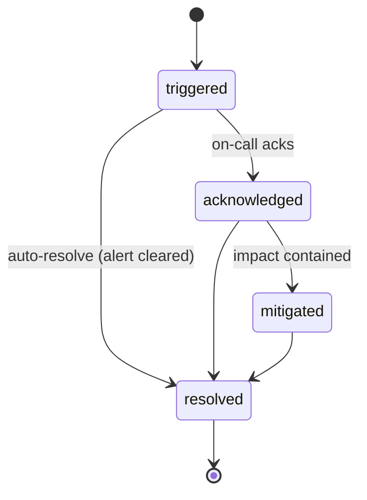

# Vigil — Development Documentation

This is the living engineering document for Vigil: what it is, why each technical decision was
made, how the system is shaped, and where it is going. Architecture decisions with long-term
consequences also get a dedicated ADR in [docs/adr](docs/adr).

---

## 1. Problem & vision

When production breaks, the failure mode is rarely "nobody got an alert." It is the opposite:
**one outage produces hundreds of alerts**, spread across Prometheus, Grafana, Sentry, and a
Slack channel nobody can read at 3 a.m. The engineer on call spends the first twenty minutes
answering three questions by hand:

1. *Is this one incident or five?* (correlation)
2. *What changed?* (deploys, config, infra)
3. *What do we do about it?* (runbooks, past incidents)

Vigil's thesis: those three questions are automatable. The platform should collapse alert noise
into a single incident with a timeline, correlate it with recent changes, propose a diagnosis
and next steps — and then **get out of the way and let a human decide**.

**One-line pitch:** an open, self-hostable incident response platform with an AI co-pilot —
"incident.io you can run on a €5 VPS."

## 2. Product scope

**Primary persona:** the on-call engineer at a small/mid engineering team (5–50 devs) that has
Prometheus + Grafana + Slack but cannot justify PagerDuty/incident.io pricing.

**MVP (Phases 1–2):** alerts in → deduplicated incidents with lifecycle + timeline → Slack
notification with ack/resolve → basic web timeline. No AI yet. The MVP must be genuinely useful
*without* the AI, or the AI is lipstick.

**Differentiator (Phase 3):** the RCA agent. Local-first (Ollama) so it costs nothing to run,
provider-pluggable (Anthropic API when budget allows), and evaluated in CI against recorded
incident fixtures — the agent has a test suite like any other component.

**Non-goals (deliberate cuts, see §11):** paging/phone escalation, mobile apps, log storage
(we correlate logs, we don't store them), replacing Grafana.

## 3. System architecture

### Current slice (Phase 1, in progress)

```
                        ┌──────────────────────── Vigil (single Go binary) ───────────────────────┐
                        │                                                                         │
 Alertmanager ─webhook─▶│  ingest ──▶ alert.Normalize ──▶ alert.Fingerprint ──▶ Deduper           │
 (or curl)              │                                                        │                │
                        │                                              incident.Store             │
                        │                                    (state machine + timeline)           │
                        │                                                        │                │
   Operator ◀──REST─────│  GET /api/incidents  ◀─────────────────────────────────┘                │
                        └─────────────────────────────────────────────────────────────────────────┘
```

Everything is in-process and behind interfaces (`incident.Store`, dedup, notification). This is
deliberate: the seams are where infrastructure gets swapped in later without touching domain
logic (ADR-002, ADR-003).

### Target architecture (Phase 3+)

```
 Alertmanager ─┐
 Grafana ──────┼─▶ ingest API ─▶ event bus (NATS JetStream) ─▶ correlator ─▶ incident service ─▶ Postgres
 Sentry ───────┘                        │                                        │
 GitHub deploys ────────────────────────┘                                        ├─▶ Slack app
                                                                                 ├─▶ SSE timeline (Next.js UI)
                                        RCA agent (Ollama/Anthropic) ◀───────────┘
                                        reads: deploys, Loki logs, Prom metrics
                                        writes: proposed diagnosis + actions (human approves)
```

## 4. Tech stack & rationale

| Layer | Choice | Rationale |
|---|---|---|
| Language | Go (stdlib-only core for now) | Infra-world lingua franca; single static binary; tiny containers; cheap to host. See ADR-001. |
| HTTP | `net/http` with Go 1.22+ method routing | No framework needed at this size; one less dependency to explain. |
| Domain events | In-process today → NATS JetStream when async consumers arrive | Don't run a broker before there are two consumers. See ADR-002. |
| Storage | In-memory behind `incident.Store` → Postgres + sqlc | Interface seam first, migration later. See ADR-003. |
| Frontend (Phase 2b) | Next.js + TypeScript + Tailwind + shadcn/ui, SSE for live timeline | Market default; SSE is simpler than WebSockets for one-way updates. |
| AI (Phase 3) | Provider-pluggable: Ollama (default, free) / Anthropic API | Same pattern proven in AutoHawk; zero-cost by default, quality on demand. |
| CI/CD | GitHub Actions: build, vet, test on every push | Table stakes; the AI eval suite joins this pipeline in Phase 3. |
| Deploy target | Docker → k3s on a single VPS, Terraform, GitOps | Real Kubernetes + IaC at hobby cost. |
| Self-observability | Prometheus + Grafana + Loki | Vigil monitors itself — and its own alerts are the demo data. |

## 5. Domain design

### 5.1 Alert normalization

Every source (Alertmanager, Grafana, Sentry, …) is normalized into one `alert.Alert` shape at
the edge. Nothing downstream knows or cares where an alert came from. Adding a source = adding
one adapter.

### 5.2 Fingerprinting

An alert's identity is its **sorted label set**, hashed (SHA-256, truncated to 16 hex chars).
`HighErrorRate{service=checkout}` firing five times is one alert re-firing, not five alerts.
Annotations are *not* part of identity — they carry human-facing text that may change between
evaluations of the same alert.

### 5.3 Deduplication

A sliding window (default 5 min) keyed by fingerprint. Within the window, a repeat firing is
recorded on the existing incident's timeline instead of opening a new incident. This is the
first line of defense against alert storms; rate-limiting and grouping-by-service come later.

### 5.4 Incident lifecycle



Transitions are validated — an invalid transition is an error, not a silent overwrite. Every
transition and every attached alert is appended to an immutable per-incident **timeline**,
which later becomes the postmortem's raw material and the audit log.

### 5.5 API (current)

| Method | Path | Purpose |
|---|---|---|
| `POST` | `/webhooks/alertmanager` | Ingest an Alertmanager webhook payload. Returns `202` with created/updated counts. |
| `GET` | `/api/incidents` | List incidents incl. state, severity, fingerprints, timeline. |
| `GET` | `/healthz` | Liveness. |

## 6. Engineering practices

- **Small commits** (≤ 3–4 files), imperative messages, body explains *why*.
- **Each commit builds and passes tests** — history is bisectable.
- **ADRs** for decisions with long-term consequences; this file for everything else.
- **Tests accompany the code they cover** in the same commit; time is injected (`now` passed
  in) so dedup-window and lifecycle tests are deterministic.
- **CI on every push**: `go build`, `go vet`, `go test`.

## 7. Roadmap

- [x] **Phase 0 — Foundation:** repo, license, this document, ADRs 001–003, CI pipeline
- [ ] **Phase 1 — Ingest → Incident (in progress)**
  - [x] Normalized alert model + fingerprinting
  - [x] Dedup window
  - [x] Incident state machine + timeline + in-memory store
  - [x] Alertmanager webhook endpoint + incidents API
  - [x] Dockerfile + compose demo stack (Vigil + Alertmanager)
  - [ ] Postgres persistence via sqlc (ADR-003 step 2)
  - [ ] k6 load test: alert-storm scenario, publish p99 numbers
- [ ] **Phase 2 — Humans in the loop:** Slack app (channel per incident, ack/resolve buttons),
      severity levels, on-call rotation-lite, SSE web timeline
- [ ] **Phase 3 — AI RCA agent:** deploy-event correlation (GitHub webhook), Loki/Prometheus
      read tools, structured diagnosis, postmortem draft, **eval suite in CI**
- [ ] **Phase 4 — SaaS hardening:** multi-tenancy + RBAC, audit log, SLO/error budgets,
      k3s + Terraform deploy, public demo with chaos button

## 8. AI RCA agent — design sketch (Phase 3)

- **Inputs:** the incident (alerts, timeline), deploy events in a ±60 min window, log excerpts
  (Loki query scoped by the alert's `service` label), key metric snapshots.
- **Output:** *structured* diagnosis — `{suspected_cause, confidence, evidence[], proposed_actions[]}` —
  rendered into the timeline as a proposal. **The agent never executes actions**; a human
  approves each one (Slack buttons).
- **Providers:** `VIGIL_AI_PROVIDER=ollama|anthropic|none`. Default `ollama` so the whole
  platform runs at zero marginal cost.
- **Evals:** 15–20 synthetic incident fixtures with known root causes (bad deploy, OOM, cert
  expiry, dependency outage, …). CI scores the agent's diagnosis against ground truth; the
  score is tracked over time like coverage. No eval, no merge.
- **Guardrails:** read-only tools, token/cost budget per incident, hard timeout, and the
  proposal is clearly labeled as machine-generated in the UI.

## 9. Self-SLOs (Phase 4)

Vigil is an incident tool; it must hold itself to targets it would page others for:

- Webhook ingestion p99 < 500 ms
- Alert → incident visible < 2 s
- Availability 99.5 % (measured by its own Prometheus, dashboard public)

## 10. Local development

```sh
go build ./...        # build everything
go vet ./...          # static checks
go test ./...         # unit tests
go run ./cmd/vigil    # run on :8080 (PORT to override)
docker compose up --build   # Vigil + Alertmanager demo stack
sh scripts/demo-alert.sh    # push a demo alert through Alertmanager into Vigil
```

## 11. Cut list (things deliberately not built, and why)

| Cut | Why |
|---|---|
| Phone/SMS paging | Twilio cost + regulatory noise; Slack covers the target persona. |
| Log storage | Loki exists; Vigil correlates logs, storing them is someone else's job. |
| Kafka | Ops weight unjustified below thousands of events/sec (ADR-002). |
| Auto-remediation | An agent that restarts prod without approval is a liability, not a feature. |
| Multi-region HA | Single-tenant self-host first; HA is a Phase 5 problem. |

## 12. Development log

> Newest first. Honest notes — including AI-assisted work — not marketing.

**2026-07-17** — Project start. Scaffolded repo, wrote this document and ADRs 001–003, and
built the first vertical slice with AI pair-assistance (Claude Code): normalized alert model
with label-set fingerprinting, sliding-window dedup, incident state machine with validated
transitions and append-only timeline, Alertmanager webhook ingestion wired to an in-memory
store, unit tests for all of the above, CI workflow, and a compose demo stack. Next up:
Postgres persistence and the k6 alert-storm load test.

## 13. ADR index

| ADR | Decision |
|---|---|
| [ADR-001](docs/adr/ADR-001-go-stdlib-core.md) | Go with a stdlib-only core |
| [ADR-002](docs/adr/ADR-002-event-pipeline.md) | In-process events now, NATS JetStream later |
| [ADR-003](docs/adr/ADR-003-storage.md) | In-memory store behind an interface, then Postgres |
